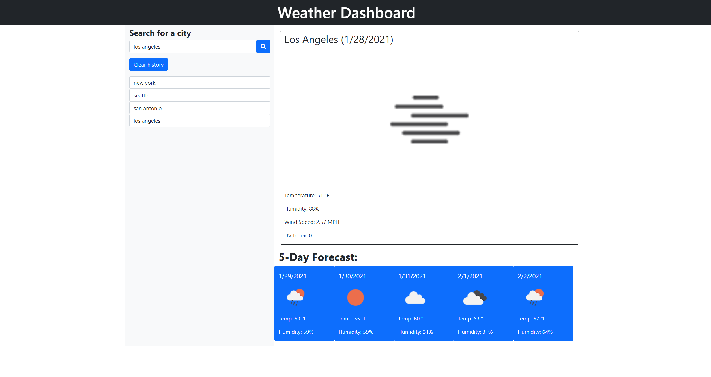
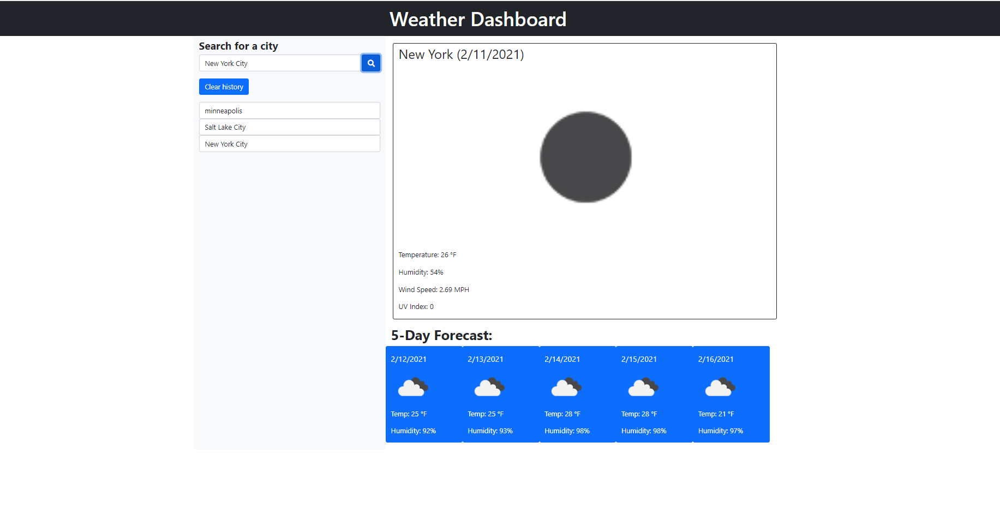

# Weather-Dash

A weather dashboard utilizing OpenWeatherMap with form inputs allowing a user to search for a city and be presented with current and future conditions for that city. The city is then added to the search history. "Current conditions" include the city name, the date, an icon representation of weather conditions, the temperature, the humidity, the wind speed, and the UV index. The UV index is color-coded to convey favorable, moderate, or severe conditions. The five-day forecast includes the date, an icon representation of weather conditions, the temperature, and the humidity. When a city is clicked from the history, the current and furute conditions for that city are again displayed. 

Link to deployed page: <a href="https://helenil.github.io/Weather-Dash/">here</a>

  
<h2>Technologies used:</h2> 
HTML, CSS, JAVASCRIPT, AJAX  
<h2>Credits:</h2>
Helen Lindberg 
Email: helenilindberg@yahoo.com 
GitHub Profile: <a href="https://github.com/HelenIL">https://github.com/HelenIL</a>  
